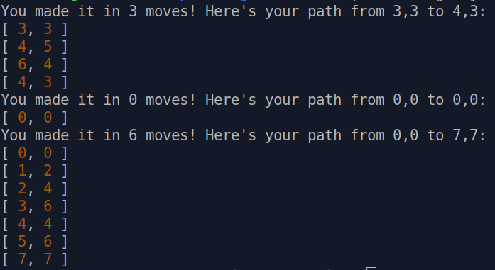

# knights-travails
Completed Knight Travails project as part of the Javascript Course in The Odin Project. This project makes use of knowledge learnt from the 'A Bit of Computer Science' section, and utilizes Breadth-First Search to traverse the data structure.
Use the function knightMoves(startCoordinate,endCoordinate), in the console, to show the shortest path for a knight in chess to go from the start coordinate to the end coordinate.
Example: knightMoves([0,0], [1,2]);
